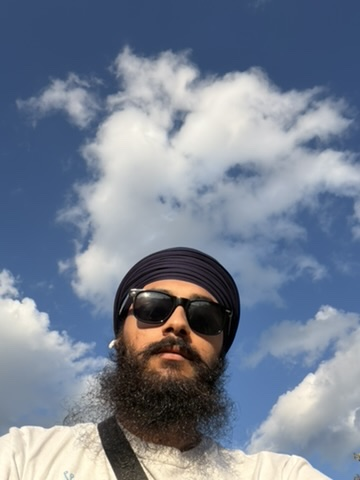
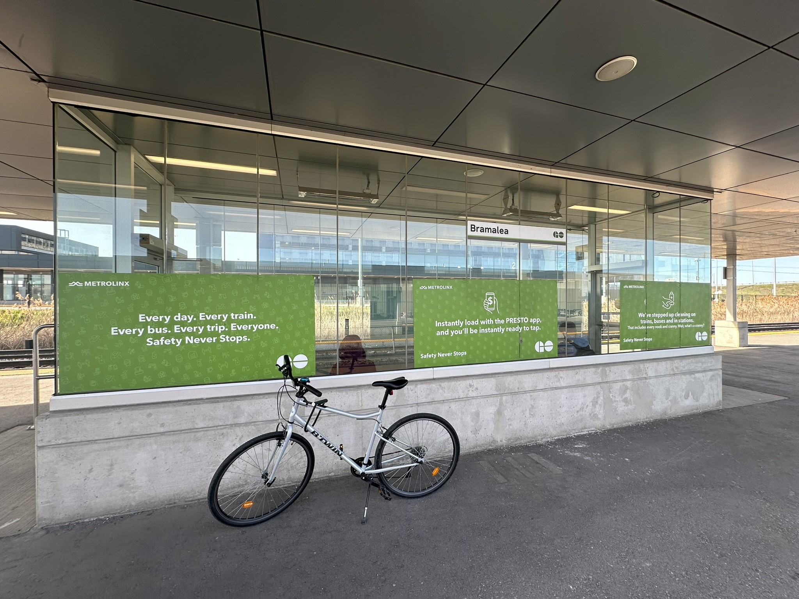

I bought myself a [Decathlon Riverside 120](https://www.decathlon.ca/en/p/hybrid-bike-riverside-120/300806/c208m8771010) from Facebook marketplace around 2 years ago and have been riding it ever since.

Its such a nice bike with big frame, good tires, brakes and all the basic things you need. I've sometimes wanted to upgrade it, but I kept putting it off. Initially, after buying it, I have used it to commute to Mount Pleasant GO Station to take my daily trains to work. I really enjoyed riding it to a nearby [Gurdwara](https://www.basicsofsikhi.com/post/what-should-i-do-before-visiting-a-gurdwara) (Sikh Prayer House) and eating Langar (I was really lazy about making food back then)

Now, fast forward to Aug 2026, I suddenly had the urge to get my bike out, ride it and upgrade it. I basically came across [a video by Romana Vasyleha](https://youtu.be/A8vUzhOId2A?si=SjUkqsWz5LSe_PRr) about taking her bike to a lake, taking a dip, and riding her bike around. I suddenly got hooked on the idea that this is what I want my fun time to look like. I got really hooked and saw [another video of hers](https://youtu.be/j1DKtZGkff4?si=Ka2FRS1Jq4W6iP1m) buying a Gravel Bike. I just wanted to buy a bike so bad that I started looking up. I knew a good new or used bike would probably cost around $1500-$2500 CAD.

Anyways, my plan got slightly changed and I have decided not to buy a new bike, rather tune up my current buddy and make it more comfortable to ride for longer distances. I've already bought a phone holder, water bottle holder and a mini bike pump. These have all been worth it.

Now I'm probably going to go to a bike shop I googled called Pedalinx in Mississauga and get a tune up. Also, I'm probably gonna buy some accessories like:
- New lights
- New bell
- Comfortable saddle or gel seat
- Frame bag for storage

Here are my latest rides from Strava:
<iframe height='454' width='300' frameborder='0' allowtransparency='true' scrolling='no' src='https://www.strava.com/athletes/174228622/latest-rides/3b6d391fe48e4252b5102869dfa004d7d670c208' ></iframe>