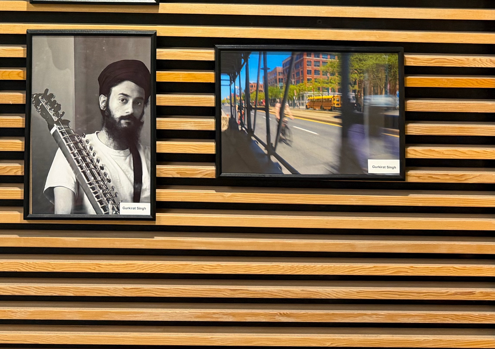

This summer I joined photography classes with JAYU for eight weeks. I literally got into the program just one day before it started, so thanks to [Des](https://www.linkedin.com/in/desiree-mckenzie-17a369113/) for allowing me in at the last minute.

They gave me a Sony a6400 camera to take home and practice with. Every week we would get a simple theme like portrait, practice motion blur, framing, and things like that. Then we would get together and show our pictures and discuss them, talking about why we chose to take that shot, what frame we used, our camera settings, and more.

[Jill](https://www.linkedin.com/in/jillian-fernandes-76793117a/) was our instructor and she was so nice. There was a lot of hands-on practice and we would go outside the Brampton library to shoot. We talked about how we took our pictures, what the settings were, aperture, white balance, ISO, all that kind of stuff. It really made us learn a lot from each other by seeing everyone else’s settings. Tess and Isabella prepared quizzes for us each week which were actually really fun.

I used to take my camera everywhere I went because I had it to take home. I would bring it to college and to work. I took some pictures with my colleagues and it was very fun. I even chose my friend [Stephanie](https://www.linkedin.com/in/stephanieywli/) as a model when I was at work (made a flickr album called "[a day in the office | summer'26](https://flic.kr/s/aHBqjCUUVc)")

Near the end of the program we also learned about editing our photos and I used Lightroom Classic to edit mine.

After a successful session of learning we were given a chance to submit some photos with the theme “I am.” The theme was pretty open-ended so we could present anything. I chose one of my photos that I took of myself practicing the Dilruba, shot in the mirror. It just turned out looking very vintage and pretty nice so I submitted that one. The other photo I submitted was of some people biking through Toronto. While I was walking to my office I saw them going by and I took a photo using motion blur.

Both of these photos are right now exhibited at the Brampton Library, Mount Pleasant Branch. That was a really proud moment for me because I had just gone into this program randomly and somehow made some really lasting connections. Jill was super nice and just very fun to chill out with. I’m hoping to continue this photography journey even though I don’t have the camera anymore. I used to take photos with my iPhone 14 Pro before that class and now I have a 17 Pro. I’m hoping to keep taking more pictures and upload them on this website.
See the work here: https://www.jayu.ca/bpl2026
