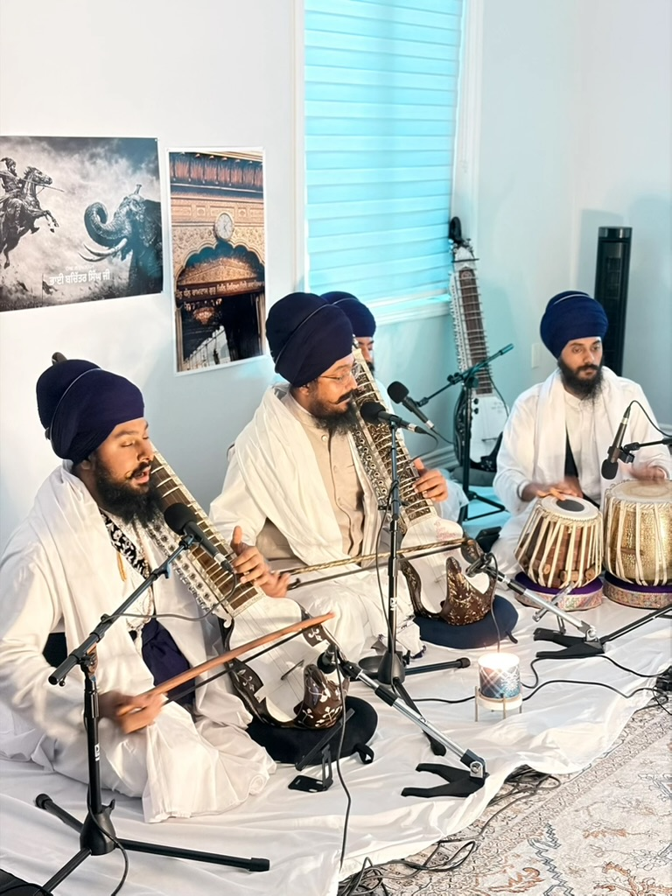
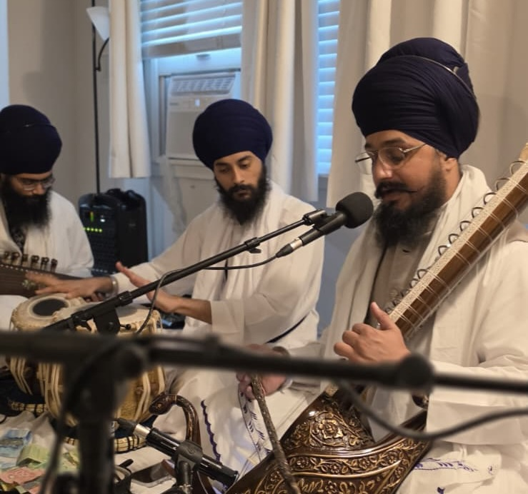

****

Music has been a part of my life since growing up. From listening to Kirtan (Sikh devotional music) to playing my first instrument which was Tabla, I have come a long way.

There's a lot of history since childhood of how I got more and more into it and even started to learn singing and playing Harmonium. But its a story of another time. I want to focus on how I keep music a part of my life in 2026 with my college and a job.

I have been curious to play [Joḍī (ਜੋੜੀ)](https://en.wikipedia.org/wiki/Jori_(instrument)) which is a *Puratan* (ancient) instrument played since the times of Paatshaahi Panjvi - Dhan Satguru Sri Guru Arjan Dev Sahib Ji Maharaj. And it has a lot of importance in Sikh Gurmat Sangeet.

Somehow, I got hands on a Jori from a friend and tried to play it. I loved its sound and deepness that it gives when hearing it. I was still in the process of learning it when one of my friends said, "Do you want to play Jori with Bhai Bahulivleen Singh?" and I was on top of clouds. From someone who rarely got turns to play Tabla/Jori, I was given a chance to play with such a master of Gurmat Sangeet.

Now these days I play Jori with [Akali Jatha](https://www.youtube.com/@bhaibahulivleensinghjee). And I'm learning it too from their academy called [Sahibzaade Academy](https://www.youtube.com/@SahibzaadeAcademy)

Below photo from an Asa Di Vaar program, July 2026

Listen to this recent recording in Raag Malaar on Soundcloud:
<iframe width="100%" height="166" scrolling="no" frameborder="no" allow="autoplay; encrypted-media" src="https://w.soundcloud.com/player/?url=https%3A//api.soundcloud.com/tracks/soundcloud%253Atracks%253A2379234044&color=%23ff5500&auto_play=false&hide_related=false&show_comments=true&show_user=true&show_reposts=false&show_teaser=true"></iframe>
<a href="https://soundcloud.com/akaali-jatha" title="Akaali Jatha_Bhai Bahulivleen Singh Jee" target="_blank" style="color: #cccccc; text-decoration: none;">Akaali Jatha_Bhai Bahulivleen Singh Jee</a> · <a href="https://soundcloud.com/akaali-jatha/baras-ghna-mera-pir-ghar-aaya" title="Baras Ghna mera pir ghar aaya || (Raag Malhar)" target="_blank" style="color: #cccccc; text-decoration: none;">Baras Ghna mera pir ghar aaya || (Raag Malhar)</a>
